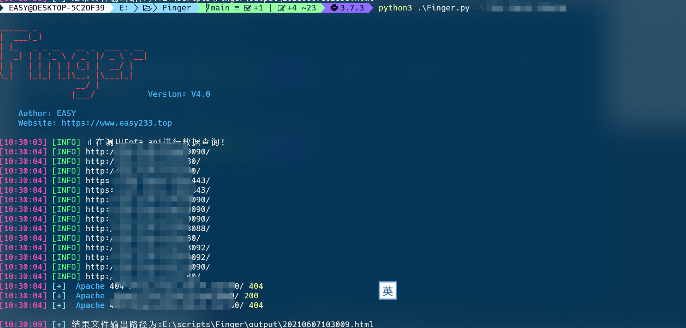
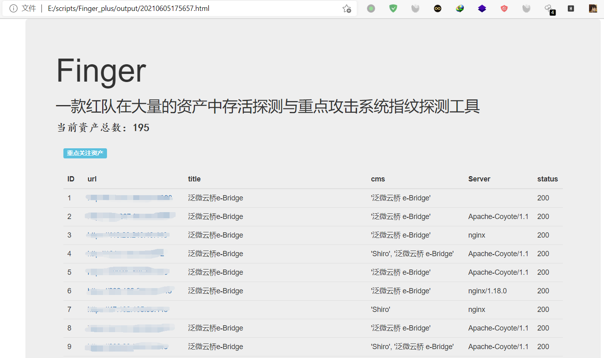

<h1 align="center">
  <br>
  
</h1>

<h4 align="center">一款红队在大量的资产中存活探测与重点攻击系统指纹探测工具</h4>

<p align="center">
  <a href="#开始">开始</a> •
  <a href="#支持选项">支持选项</a> •
  <a href="#指纹识别规则">指纹识别规则</a> •
  <a href="#实际效果">实际效果</a> •
  <a href="#todo">TODO</a> •
  <a href="#更新日志">更新日志</a> •
  <a href="#感谢列表">感谢列表</a>
</p>
<p align="center">
    
    </a>
    
</p>


## 开始

Finger定位于一款红队在大量的资产中存活探测与重点攻击系统指纹探测工具。在面临大量资产时候Finger可以快速从中查找出重点攻击系统协助我们快速展开渗透。早有前辈贡献出优秀的作品[[EHole(棱洞)2.0 重构版-红队重点攻击系统指纹探测工具](https://github.com/EdgeSecurityTeam/EHole) 但是该项目代码不开源我想做出一些修改也没有办法，所以决定使用其指纹库自行开发一个趁手的工具。

## 支持选项

### 下载使用

Finger使用python3.7开发全平台支持,可以使用下面命令下载使用:

```html
git clone https://github.com/EASY233/Finger.git
pip3 install -r requirements.txt
python3 Finger.py -h
```

### 参数说明

Finger追求极简命令参数只有以下几个:

- -u  对单个URL进行指纹识别
- -f   对指定文件中的url进行批量指纹识别
- -i    对ip进行fofa数据查询采集其web资产
- -if   对指定文件中的ip批量调用fofa进行数据查询采集其web资产
- -o  指定输出方式默认不选择的话是html格式，支持html，json，xls。

Finger支持的URL格式有:www.baidu.com , 127.0.0.1,http://www.baidu.com。 但是前两种不推荐使用Finger会在URL处理阶段自动为其添加``http://``和``https://``

Finger支持的IP格式有单个IP格式192.168.10.1,IP段192.168.10.1/24，某一小段IP192..168.10.10-192.168.10.50满足日常使用的所有需求。Finger会首先通过Fofa采集IP的web资产，然后对其进行存活探测以及系统指纹探测。

### 配置说明

默认线程数为50实际需要修改可以在`config/config.py`中进行修改，调用fofa查询功能需要从配置文件修改为自已对应的fofa api信息。

```
threads = 50
Fofa_email = ""
Fofa_key = ""
# 普通会员API查询数据是前100，高级会员是前10000条根据自已的实际情况进行调整。
Fofa_Size = 100
# 是否选择在线跟新指纹库，默认为True每次程序都会检查一遍指纹库是否是最新
FingerPrint_Update = True
```

## 指纹识别规则

Finger的指纹规则学习之[EHole(棱洞)2.0 重构版-红队重点攻击系统指纹探测工具](https://github.com/EdgeSecurityTeam/EHole)。指纹格式如下:

```
cms：系统名称
method：识别方式 (支持三种识别方式，分别为：keyword、faviconhash、regula)
location：位置（指纹识别位置，提供两个位置，一个为body，一个为header）
keyword：关键字（favicon图标hash、正则表达式、关键字）
```

keyword支持多关键字匹配，需要所有关键字匹配上才能识别。

一个简单例子:

```json
{
		"cms": "seeyon",
		"method": "keyword",
		"location": "body",
		"keyword": ["/seeyon/USER-DATA/IMAGES/LOGIN/login.gif"]
}
```

## 实际效果

URL批量扫描效果如下:


调用Fofa效果扫描如下:



扫描报告样式学习自[AUTO-EARN](https://github.com/Echocipher/AUTO-EARN)，重点资产和普通资产分开展示:


## TODO

- [x] 1.对接网络空间搜索引擎
- [x] 2.优化输出模板样式。
- [x] 3.实现在线同步指纹库。

## 更新日志

没想到能够获取到这么多star，真的非常高兴也让我更加坚定把该工具开发的更加完善。

### V4.1更新说明

- 修复了不能通过faviconhash进行指纹识别的严重bug
- 优化了html格式的输出报告
- 添加了Fofa数据查询功能

### V4.2更新说明

- 实现了在线同步指纹库功能，每一次运行程序Finger都会首先检查指纹库是否和Github仓库的指纹库md5值是否吻合，若不吻合会自动下载指纹库到本地使用，原来的数据库以finger_时间戳.json.bak的文件样式备份到本地，指纹库由本人维护更新。自动更新指纹库功能可在``config/config.py``关闭。
- 修复了若干bug。

### V4.3更新说明
- 优化扫描速度，在日常使用过程中发现某些情况下网站打开后会直接下载资源响应包会比正常的网站要大上许多，严重影响了Finger的扫描速度。解决方法：在requests请求中追加了`stream=True`参数，此时仅有响应头被下载下来了，连接保持打开状态，当满足了我们的要求`int(response.headers.get("content-length",default=1000)) < 100000:` 才会访问响应包资源，使用者可根据自身需求修改该阀值。
## 感谢列表
在开发过程中参考学习了非常多前辈们的优秀开源项目，特此感谢!

[Glass(镜) V2.0-剑客到刺客的蜕变](https://github.com/s7ckTeam/Glass)

[EHole(棱洞)2.0 重构版-红队重点攻击系统指纹探测工具](https://github.com/EdgeSecurityTeam/EHole)

[WebAliveScan](https://github.com/broken5/WebAliveScan)

[AUTO-EARN](https://github.com/Echocipher/AUTO-EARN)

感谢**Ti0s** 提供的建议

