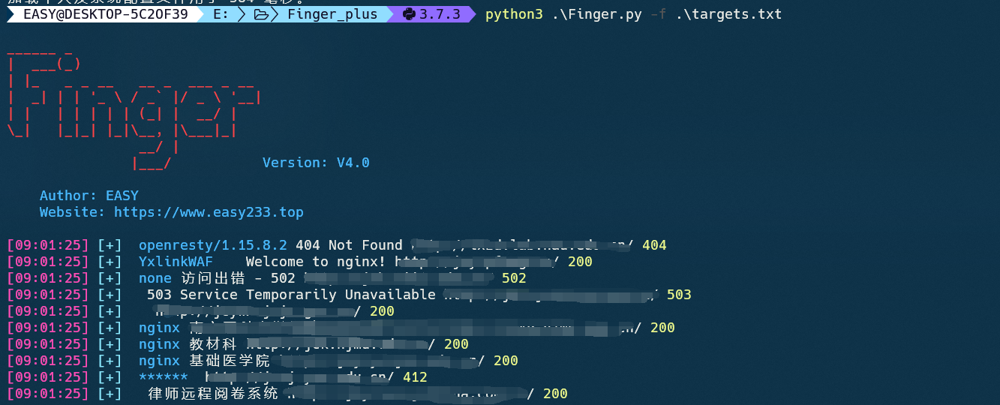
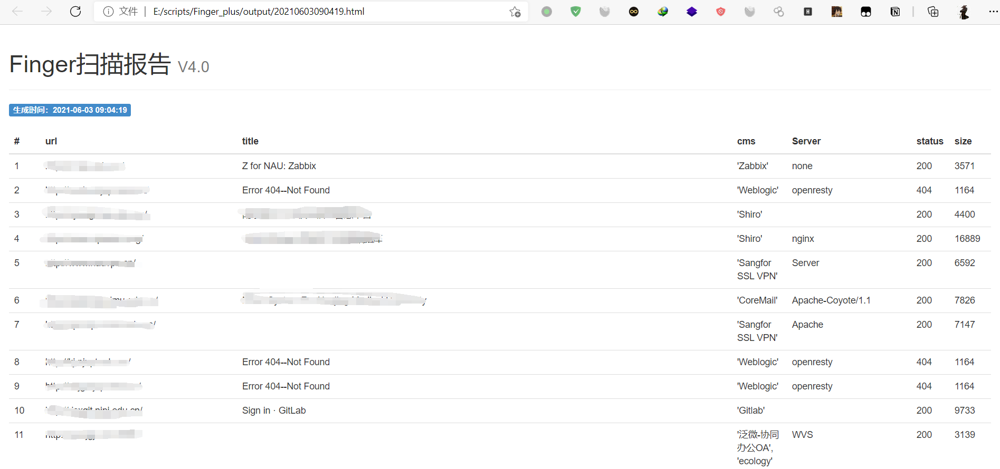

<h1 align="center">
  <br>
  
</h1>

<h4 align="center">一款红队在大量的资产中存活探测与重点攻击系统指纹探测工具</h4>

<p align="center">
  <a href="#开始">开始</a> •
  <a href="#支持选项">支持选项</a> •
  <a href="#指纹识别规则">指纹识别规则</a> •
  <a href="#实际效果">实际效果</a> •
  <a href="#todo">TODO</a> •
  <a href="#感谢列表">感谢列表</a>
</p>

<p align="center">
    
    </a>
    
</p>


## 开始

Finger定位于一款红队在大量的资产中存活探测与重点攻击系统指纹探测工具。在面临大量资产时候Finger可以快速从中查找出重点攻击系统协助我们快速展开渗透。早有前辈贡献出优秀的作品[[EHole(棱洞)2.0 重构版-红队重点攻击系统指纹探测工具](https://github.com/EdgeSecurityTeam/EHole) 但是该项目代码不开源我想做出一些修改也没有办法，所以决定使用其指纹库自行开发一个趁手的工具。

## 支持选项

### 下载使用

Finger使用python3.7开发全平台支持,可以使用下面命令下载使用:

```html
git clone https://github.com/EASY233/Finger.git
pip3 install -r requirements.txt
python3 Finger.py -h
```

### 参数说明

Finger追求极简命令参数只有以下几个:

- -u  对单个URL进行指纹识别
- -f   对指定文件进行批量指纹识别
- -o  指定输出方式默认不选择的话是html格式，支持html，json，xls。

Finger支持的URL格式有:www.baidu.com , 127.0.0.1,http://www.baidu.com。 但是前两种不推荐使用Finger会在URL处理阶段自动为其添加``http://``和``https://``

### 配置说明

默认线程数为50实际需要修改可以在`config/config.py`中进行修改

```
threads = 50
```

## 指纹识别规则

Finger的指纹规则学习之[EHole(棱洞)2.0 重构版-红队重点攻击系统指纹探测工具](https://github.com/EdgeSecurityTeam/EHole)。指纹格式如下:

```
cms：系统名称
method：识别方式 (支持三种识别方式，分别为：keyword、faviconhash、regula)
location：位置（指纹识别位置，提供两个位置，一个为body，一个为header）
keyword：关键字（favicon图标hash、正则表达式、关键字）
```

keyword支持多关键字匹配，需要所有关键字匹配上才能识别。

一个简单例子:

```json
{
		"cms": "seeyon",
		"method": "keyword",
		"location": "body",
		"keyword": ["/seeyon/USER-DATA/IMAGES/LOGIN/login.gif"]
}
```

## 实际效果



扫描报告样式取自Glass样式报告，对识别出来的重点资产(即是CMS识别到的资产)会优先展示出来:


## TODO

- [ ] 1.对接网络空间搜索引擎
- [ ] 2.优化输出模板样式。
- [ ] 3.实现在线同步指纹库。

## 感谢列表

[Glass(镜) V2.0-剑客到刺客的蜕变](https://github.com/s7ckTeam/Glass)

[EHole(棱洞)2.0 重构版-红队重点攻击系统指纹探测工具](https://github.com/EdgeSecurityTeam/EHole)

[WebAliveScan](https://github.com/broken5/WebAliveScan)

感谢**Ti0s** 提供的建议

