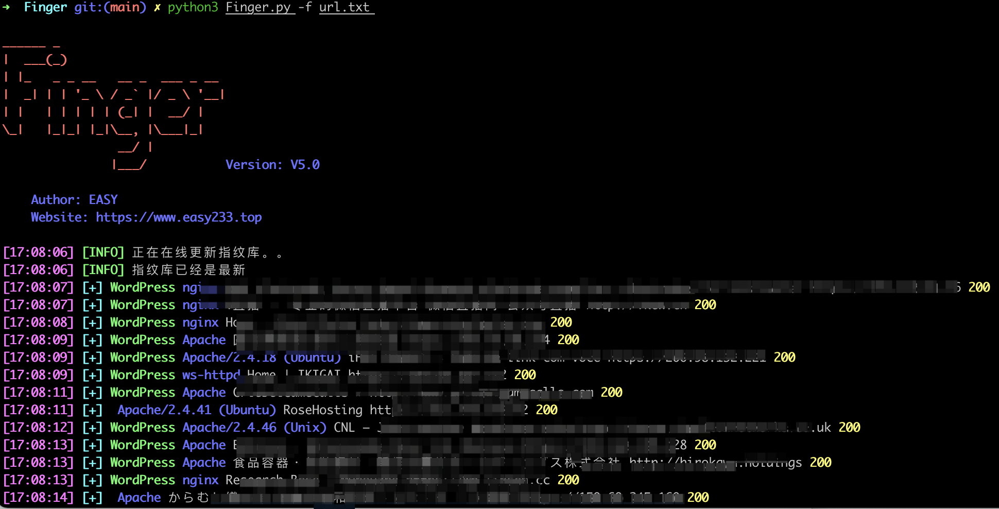
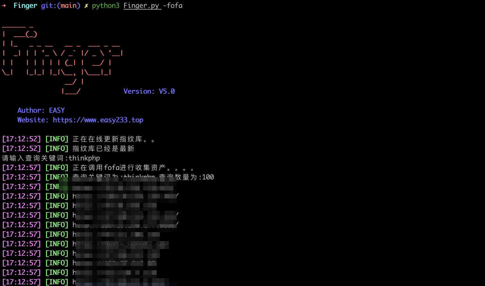
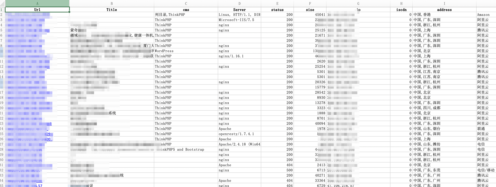

<h1 align="center">
  <br>
  
</h1>

<h4 align="center">一款红队在大量的资产中存活探测与重点攻击系统指纹探测工具</h4>

<p align="center">
  <a href="#开始">开始</a> •
  <a href="#更新日志">更新日志</a> •
  <a href="#支持选项">支持选项</a> •
  <a href="#指纹识别规则">指纹识别规则</a> •
  <a href="#实际效果">实际效果</a> •
  <a href="#todo">TODO</a> •
  <a href="#感谢列表">感谢列表</a>
</p>
<p align="center">
    
    </a>
    
</p>


## 开始

Finger定位于一款红队在大量的资产中存活探测与重点攻击系统指纹探测工具。在面临大量资产时候Finger可以快速从中查找出重点攻击系统协助我们快速展开渗透。早有前辈贡献出优秀的作品[[EHole(棱洞)2.0 重构版-红队重点攻击系统指纹探测工具](https://github.com/EdgeSecurityTeam/EHole) 但是该项目代码不开源我想做出一些修改也没有办法，所以决定使用其指纹库自行开发一个趁手的工具。

## 更新日志

没想到能够获取到这么多star，真的非常高兴也让我更加坚定把该工具开发的更加完善。

###  2022-3-18 更新

- 本次更新之后Finger会把所有请求失败的资产同样保存下来，并记录下请求失败原因方便手动检查
- 对输入目标进行了简单的去除特殊字符处理。
- 修复部分小bug

这样改进的原因主要是日常做项目的时候，客户给的资产中经常有url格式不正确的情况出现

例如：

```
http://"www.baidu.com
http://www.baidu.com(备注)
移动端:www.baidu.com
.......
```

或者因为网络原因请求超时，这种情况以往Finger会把这些资产全部抛弃保存导致错过了很多资产。

现在会把所有所有失败的请求，以及失败的原因保存在表格的最下面。


**⚠️注意**
更新后保存为xlsx后打开可能会出现如下问题:


点击进行修复-删除即可


这是因为部分链接不符合url格式导致，**进行修复不会导致任何数据丢失！！**


### V5.0 版本大更新

- 取消html输出格式，默认使用xlsx格式保存数据，目前只支持xlsx和json保存数据
- 增加自动获取IP，识别CDN，获取ip归属地功能。
- 增加调用fofa，360quake的api来搜集资产，并自动进行存活探测以及指纹识别(⚠️**注意Finger调用api的时候仅获取web资产**)。
- 修复若干bug

### V5.1 更新

- 优化输出
- 修复通过fofa api查询web信息不全的bug

## 支持选项

### 下载使用

Finger使用python3.7开发全平台支持,可以使用下面命令下载使用:

```html
git clone https://github.com/EASY233/Finger.git
pip3 install -r requirements.txt
python3 Finger.py -h
```

### 参数说明

Finger追求极简命令参数只有以下几个:

- -u  对单个URL进行指纹识别
- -f   对指定文件中的url进行批量指纹识别
- -i    对ip进行fofa数据查询采集其web资产
- -if   对指定文件中的ip批量调用fofa进行数据查询采集其web资产
- -fofa 调用fofa api进行资产收集
- -quake 调用360 quake进行资产收集
- -o  指定输出方式默认不选择的话是xlsx格式，支持json，xls。

Finger支持的URL格式有:www.baidu.com , 127.0.0.1,http://www.baidu.com。 但是前两种不推荐使用Finger会在URL处理阶段自动为其添加``http://``和``https://``

Finger支持的IP格式有单个IP格式192.168.10.1,IP段192.168.10.1/24，某一小段IP192..168.10.10-192.168.10.50满足日常使用的所有需求。Finger会首先通过Fofa采集IP的web资产，然后对其进行存活探测以及系统指纹探测。

### 配置说明

默认线程数为30实际需要修改可以在`config/config.py`中进行修改，调用api查询功能需要从配置文件修改为自已对应的 api信息。

```
# 设置线程数，默认30
threads = 30

# 设置Fofa key信息
Fofa_email = ""
Fofa_key = ""
# 普通会员API查询数据是前100，高级会员是前10000条根据自已的实际情况进行调整。
Fofa_Size = 100

# 设置360quake key信息，每月能免费查询3000条记录
QuakeKey = ""

# 是否选择在线跟新指纹库，默认为True每次程序都会检查一遍指纹库是否是最新
FingerPrint_Update = True
```

## 指纹识别规则

Finger的指纹规则学习之[EHole(棱洞)2.0 重构版-红队重点攻击系统指纹探测工具](https://github.com/EdgeSecurityTeam/EHole)。指纹格式如下:

```
cms：系统名称
method：识别方式 (支持三种识别方式，分别为：keyword、faviconhash、regula)
location：位置（指纹识别位置，提供两个位置，一个为body，一个为header）
keyword：关键字（favicon图标hash、正则表达式、关键字）
```

keyword支持多关键字匹配，需要所有关键字匹配上才能识别。

一个简单例子:

```json
{
		"cms": "seeyon",
		"method": "keyword",
		"location": "body",
		"keyword": ["/seeyon/USER-DATA/IMAGES/LOGIN/login.gif"]
}
```

## 实际效果

URL批量扫描效果如下:



调用api进行资产收集效果扫描如下:



默认使用xlsx对数据进行保存，重点资产和普通资产分开展示:


## TODO

- [ ] 1.优化指纹识别规则
- [ ] 2.提高ip归属地识别的精确性

## 感谢列表
在开发过程中参考学习了非常多前辈们的优秀开源项目，特此感谢!

[Glass(镜) V2.0-剑客到刺客的蜕变](https://github.com/s7ckTeam/Glass)

[EHole(棱洞)2.0 重构版-红队重点攻击系统指纹探测工具](https://github.com/EdgeSecurityTeam/EHole)

[WebAliveScan](https://github.com/broken5/WebAliveScan)

[AUTO-EARN](https://github.com/Echocipher/AUTO-EARN)

[Ip2region](https://github.com/lionsoul2014/ip2region)

[OneForAll是一款功能强大的子域收集工具](https://github.com/shmilylty/OneForAll)

感谢**Ti0s** 提供的建议
[](https://starchart.cc/EASY233/Finger)

